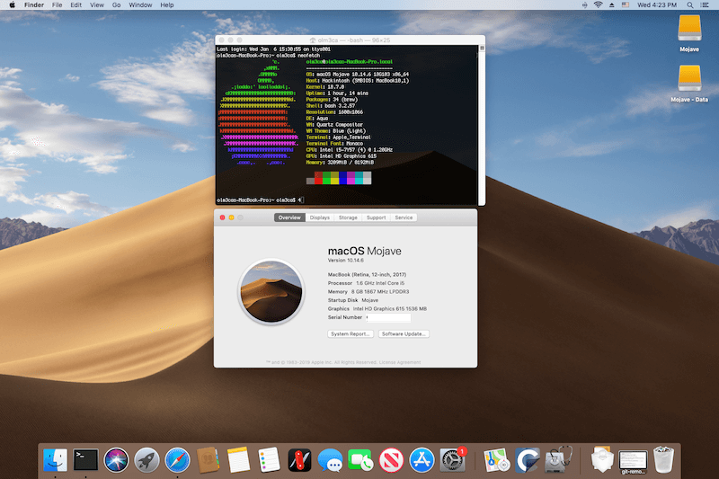

# Installing Mac OS Mojave on the Google Pixelbook 
We've managed to install GNU/Linux, Windows and now... Mac OS! It turns out Mojave works quite well on this hardware. 

|      |       |
|------------|-------------|
|||

## This is a work-in-progress guide.
Not all of the functionality is working. This will be updated frequently as fixes are identified. At the moment this guide is focused on Mac OS 10.14.6 Mojave as it has the best support for our hardware.

## A note on Pixelbook hardware
For OS X purposes, what matters most in the [specs for the Pixelbook](https://support.google.com/pixelbook/answer/7504948?hl=en) is not so much about the i5-7Y57 or i7-7Y75 processor. The biggest difference for our purposes is the internal SSD. The 128GB and 256GB models have an EMMC SSD, and it is currently not working within OS X. The i7 with 512GB has an NVMe SSD, which is fully supported. So unless you have the 512GB hard drive, installing OS X to the internal drive is currently not possible. It does work on an external SSD, however. Other notable specs:
-  Intel wifi chip: 7265
-  keyboard - PS/2
-  touchpad: HID-over-I²C
-  Suspend: ACPI S3 sleep
-  Audio: Audio Codec: uses unsupported codecs MAX98927 as speakers and RT5514 as dmic on ssp0 and RT5663 as headset on ssp1... Not currently working, but also not impossible. As a cheap and easy workaround, a [$10 USB sound adapter](https://www.amazon.com/Syba-external-Adapter-Windows-C-Media/dp/B001MSS6CS) or bluetooth audio work perfectly well. 

## Current Status

Here's what's working at the moment:

| Feature            | Status               | Notes                                                             |
|--------------------|----------------------|-------------------------------------------------------------------|
| WiFi               | Working              | Working                                                           |
| Bluetooth          | Working              | Working                                                           |
| Suspend / Sleep    | Working              | Works, follow OC [guide fix here](https://dortania.github.io/OpenCore-Post-Install/universal/sleep.html#preparations)                                                   |
| Touchpad           | Working (partially)  | Install [Karabiner 12.10.0](https://github.com/pqrs-org/Karabiner-Elements/releases/download/v12.10.0/Karabiner-Elements-12.10.0.dmg) and go to Devices to enable ID 6353     |
| Graphics Accel.    | Working!             | On Mojave only, not Catalina or Big Sur.                          |
| Sound              | Not Working          | Partially working with bluetooth / USB sound adapter              |
| Keyboard backlight | Working (partially)  | 50% always on from latest MrChromebox firmware                    |
| Touchscreen        | Working              | With VoodooI2C.kext and VoodooI2CHID.kext                         |

### Requirements

Before you start, you'll need to have the following things to complete the process:

- A [SuzyQable CCD Debugging cable][suzyqable], ~$15 USD + shipping
- A USB-A to USB-C adapter
- 1 USB flash drives with USB-C connectors or adapters, preferably ~10GB or larger
- A willingness to accept that this is a potentially destructive process that may render your
  expensive Pixelbook inoperable or otherwise busted. See the [disclaimer](#disclaimer) below.

### Mandatory Disclaimer

The process described in this document could cause irreversible damage to your expensive laptop, and
you should prepare yourself mentally and emotionally for that outcome before you begin. I accept absolutely no responsibility for the consequences of anyone choosing to follow or ignore any of the instructions in this document, and make no guarantees about the quality or effectiveness of the
software in this repo.

## Installation

Here are the steps to go from stock Pixelbook to a Mac OS 10.14.6 Mojave install using Opencore 0.6.6:

1. Flash UEFI firmware. Read and follow [yusefnapora's excellent guide](https://github.com/yusefnapora/pixelbook-linux) on how to flash the UEFI firmware using MrChromebox's scripts. To do this, you will need to disable write protect with either the SuzyQable cable or by removing the battery. 
2. Download and set up your Mac OS X Mojave USB install media. [gibMacOS](https://github.com/corpnewt/gibMacOS) is a great tool for downloading it. 
    - Before you make the install USB, make sure it is formatted as Mac OS Extended (Journaled) with GUID Partition Map.
    - To create the installer on a Mac in Terminal: `sudo /Applications/Install\ macOS\ Mojave.app/Contents/Resources/createinstallmedia --volume /Volumes/MyVolume` and replace MyVolume with the name of your target drive.

4. Download my **EFI folder** [here](https://www.dropbox.com/s/2h4ybwq4d262q6y/EFI%20Mojave%20PB.zip?dl=0)
    - Make sure to copy the entire contents of the EFI above, starting from the EFI folder itself. So inside the EFI partition it should start with EFI, followed by BOOT and OC folders, etc. For more information visit the OpenCore [guide](https://dortania.github.io/OpenCore-Install-Guide/installer-guide/opencore-efi.html)
6. When the Mojave install media is ready, mount the EFI partition with the [MountEFI](https://github.com/corpnewt/MountEFI) utility and copy the contents of the latest EFI linked above into this partition.
7. Now, boot from the Mojave installer. In Disk Utility, go to Show All Devices in the top left, and then select the entire drive to format it as APFS.
    - If you have the 512GB model, you can use the internal drive. For everyone else, an external SSD is the way to go.
    - After about 10 minutes or so, it will reboot. Go back into the boot menu and select your Mojave install media. In the opencore boot menu you should now see "Mac OS Install" as a menu item. Select that to continue the installation. 
    - The second phase of the installation will continue for about 15-20 minutes. 
    - At the end, it may fail with an error. Power down the Pixelbook.
8. Before you can boot from the new Mojave installation (on your 512GB internal drive or external SSD), you will need to copy the EFI to your new Mojave drive using the same procedure from step 4.  

8. After install: 
    - You may have an error setting up wifi in the initial setup process - continue without connecting to the internet and it will work once you're finished setting up everything. 
    - To fix sleep, you may want to follow these steps from the OC [guide fix here](https://dortania.github.io/OpenCore-Post-Install/universal/sleep.html#preparations)
    - Sound currently works via bluetooth or a USB sound adapter. 
    - Karabiner (linked above, must be version 12.10.0 can make the touchpad functional, but not great. It's also helpful for remapping the keyboard to match what the Pixelbook F1-F10 keys do.

9. Still being worked on: 
    - Screen brightness
    - Keyboard brightness
    - Sound (who knows, maybe we can get it working)
    - Upgrade to Catalina / Big Sur. This is problematic as we have never been able to get graphics acceleration working on either. With this same EFI it fails to boot. Using an invalid iGPU, it boots, but performance is horrible. 

